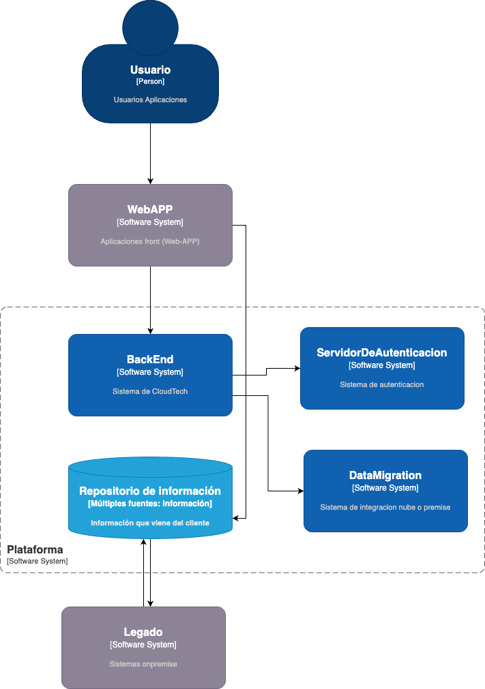
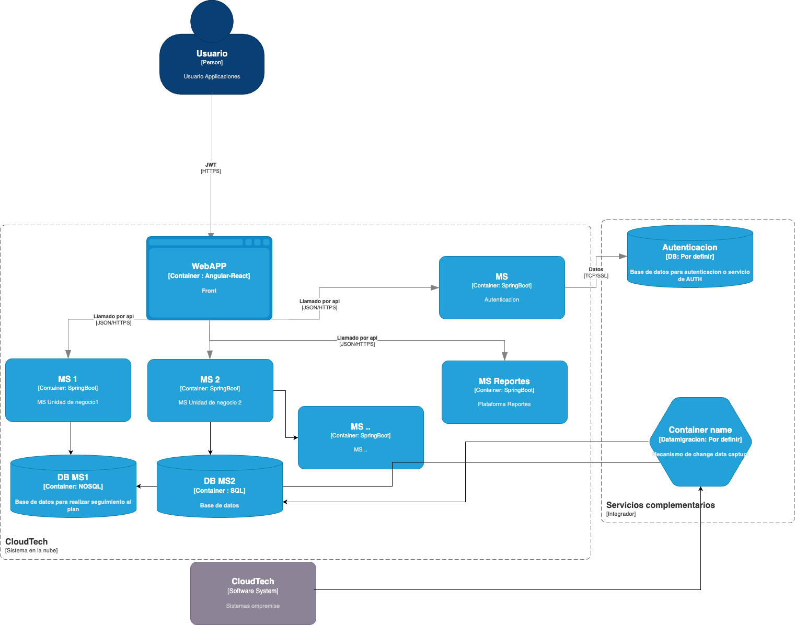
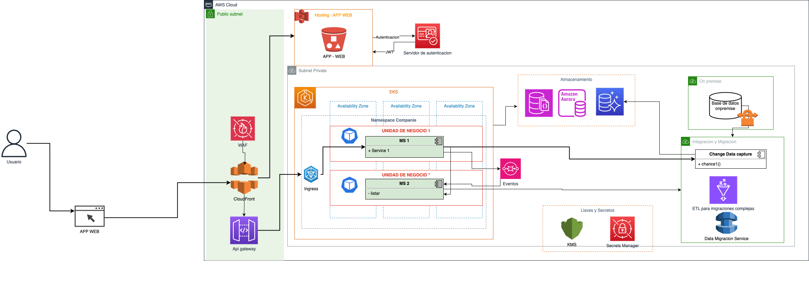

# <a href="https://github.com/janneison">JANNEISON GERMAN GALINDO RIVERA</a>

# Escenario de Evaluación para Candidato a Arquitecto TI
En esta documentacion se resuelve la prueba tecnica para el cargo de arquitecto de solución.

## Arquitectura

El problema plantea una arquitectura orientada a microservicios con el objectivo de satisfacer la demanda a medida que aumente su uso, tambien es importante evitar hacer bigbang fundamentalmente con  el backend, posiblemente con el CDN apoyado con microfrontend se pueda utilizar la aplicacion actual y migrarla poco a poco en caso que no acepte una facil migracion a la nube si esta echa en angular o react solo seria apoyarse en un apigateway para gestionar las peticiones, tambien podemos incluir el uso de evento para casos de negocio que sea asincronos como el cierre financiero. El siguiente diagrama ilustra la solución de manera general con contexto de la misma.

## Diagrama de contenedor

El siguiente diagrama ilustra de manera general la solucion planteada con algunas decisiones tecnicas y otras pendiente de revision de todos los driver de arquitectura.

## Arquitectura de solucion

El siguiente diagrama de componentes que se realiza a manera de arquitectura cloud ilustra los servicios, algunas patrones de arquitectura sugeridos como apigateway, eventos, algunos servicios de seguridad los cuales se describen al pie de la imagen.

Descripción de los servicios a usar.

- FrontEnd: Se sugiere desplegarla con s3, tambien se podria utilizar amplify para desplegarlo, en este caso sugerimos un bucket para sitios web estaticos, con el objetivo de usar un servicio serverless y se podria usar amplify como mecanismos de despliegue, pero lo ideal es crear un proceso de devsecops o adapatarse al actual de la compañia, adicionalmente se usara cloudfront para entregar el contenido de la app web.
- Apigateway: Se utilizara para entregar las api de los servicios expuestos ya sea por EKS, lambda, un servicio que aun no se migre del monolito, de igual manera se utilizara la funcion de autorizador para utilizar la autenticacion existente.
- Microservicios: Se orquestaran en kubernetes y adicionalmente los exporadicos se sugiere convertirlos en aws lambdas.
- SNS: El diagrama muestra un SNS el cual se puede utilizar para el manejo de eventos.
- Cloudwacth: aqui manejaremos los logs, no se ilustra en el diagrama  pero se pretende usarlo para observabilidad.
- Almacenamiento: aqui observamos los 4 tipos de almacenamiento que seran usados dependiendo del caso de uso, por ejemplo la parametrizacion en bases de datos relacionales, los eventos en mongo, y el registro en una base de datos clave valor como dynamoDB.
- Seguridad: Se usuara kms para guardar certificados de seguridad, secret manager para los secretos y waf para la seguridad perimetral, la autenticacion con un servidor de autenticacion, VPN para integrar los servicios on premise, todos los microservicios se realizaran siguiendo OWASP.

## Decisiones Tecnicas

- Alta disponibilidad:
Para suplir la alta disponiblidad en el frontend se propone utilizar un servicio global tipo s3 para hosting de la aplicacion, que junto con un CDN nos garantizan la disponibilidad del servicio, en el caso del backend se utilizar microservicios que usaran la capacidad de autoescalado, acompañandos de la capacidad de balanceador de EKS y/o kubernetes. por ultimo para las bases de datos se manejaran dos zonas de disponiblidad y se sugiere usar en caso de ser relacionar un servicio como aurora que tiene alta disponibilidad y se pueden crear maquinas de lectura para repartir las cargas muy similar a cqrs.
- Integraciones:
Se utilizara una vpn para conectar con el sistema onpremise para evitar exponer las bases de datos por internet.
Para integrar con terceros se propone crear micros especificos, y/o usar apigateway para que se conecte entregandoles un apikey y un plan de uso.
- Migración de datos:
la migracion inicial se usara un sistema de migracion tipo database migration-ETL para casos en los que cambie el tipo de persistencia y o se aislen tablas, y un mecanismo de change data capture para las tablas que funcionen hibridas

## Definir métodos de integración y de exposición de datos

Para exponer los datos utilizaremos api de tipo rest, y las respuestas estaran en json. Si es necesario enviar la información a un sistema externo se sugiere el uso de Apis y/o Colas. 

Los datos tambien se expondran en una web la cual solo se podra acceder por https y debidamente autenticados.

## Patrones, estilos y tacticas a usar.

- FrontEnd: Utilizaremos microfrontEnd que utilicen arquitectura hexagonal, para minimizar el impacto del uso del framework web que se escoja.

- Microservicios: Desde la arquitectura de AWS, se observa que tenemos una arquitectura orientada a microservicios, que planea utilizar para la observabilidad a cloudwatch, tambien como se usa EKS se hace necesario usar healtcheck, tambien utilizaremos el patron apigateway para descubir los servicios, de igual manera la arquitectura queda preparada para el uso de eventos.

- Tambien utilizaremos database per services, y es un sistema poliglota a nivel de persistencia, y por ultimo cabe resaltar que se utilizara arquitectura hexagonal para crear los microservicios.

- Se sugiere hacer un desarrollo orientado a pruebas para asegurar la calidad del mismo y seguir el marco de OWASP para el desarrollo de la web y los servicios.

## Conclusiones

Podemos observar un sistema que puede ser reutilizable para la creacion de cualquier tipo de eventos, seguramente la arquitectura  de solución y de software deba profundizarse y evolucionarse a medida que  se creen las historias de usuario y se definan todos los escenarios.

